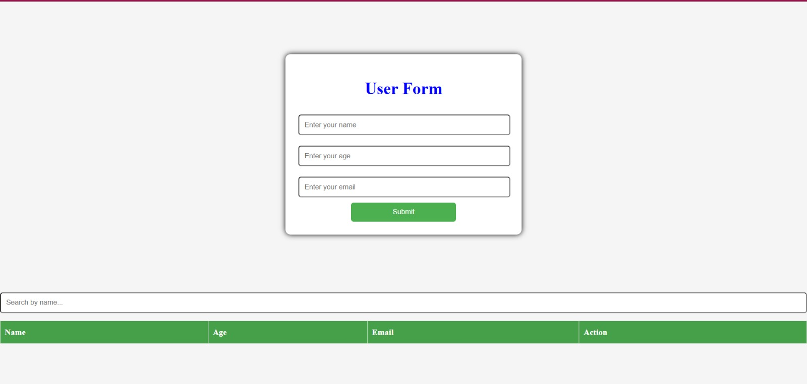
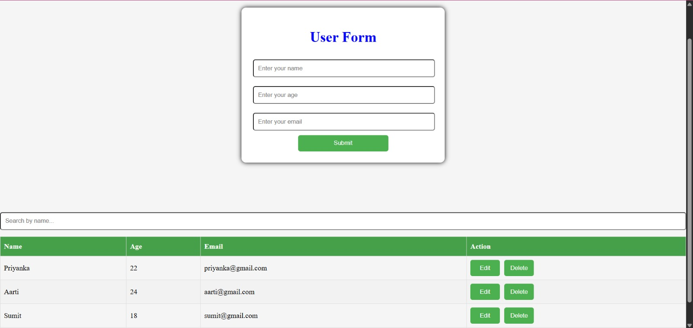
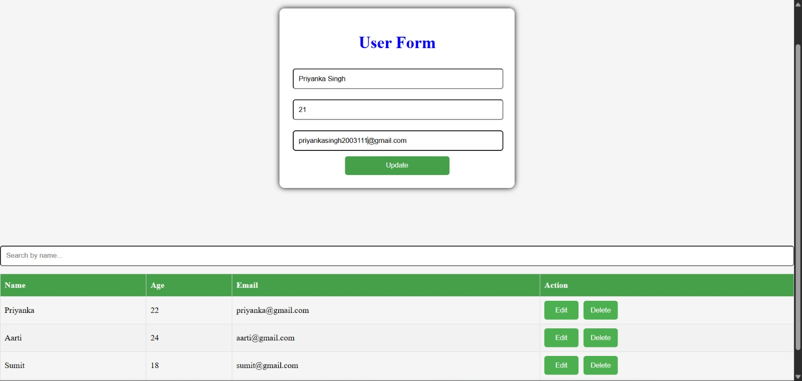

# User Management Frontend (AWS Deployed Web App)

This is the frontend of a full-stack web application deployed on AWS. It is built using React and hosted on AWS S3, interacting with a backend API running on EC2.

---

## 🚀 Features

* Add new users (name, age, email)
* View all users in a table
* Edit existing user details
* Delete users
* Real-time UI updates via API

---

## 🛠️ Tech Stack

* React (Vite)
* JavaScript (ES6)
* Fetch API
* CSS

---

## 📂 Project Structure

```
src/
 ├── App.jsx
 ├── components/
 ├── styles/
 └── main.jsx
```

---

## ⚙️ How It Works

* User interacts with the frontend UI
* Frontend sends HTTP requests to backend API (EC2)
* Backend processes the request and returns JSON data
* UI updates dynamically based on API response

---

## 🏗️ Architecture

* Frontend is hosted on AWS S3 (static website hosting)
* Backend is deployed on AWS EC2
* Frontend communicates with backend via public API

### Flow:

User → S3 (Frontend) → EC2 (Backend API) → Response → UI update

---

## 🌐 API Integration

This frontend connects to the backend API hosted on EC2.

### Base URL:

http://13.218.149.47:3000

### Endpoints Used:

| Method | Endpoint          | Description   |
| ------ | ----------------- | ------------- |
| GET    | /users            | Get all users |
| POST   | /users/post       | Create user   |
| PATCH  | /users/patch/:id  | Update user   |
| DELETE | /users/delete/:id | Delete user   |

---

## ☁️ Deployment

### Frontend (AWS S3)

* Built using:

````
npm run build
``` 

- Uploaded build files to S3 bucket  
- Enabled static website hosting  

---

## 🧪 Run Locally

```
npm install
npm run dev
````

---

## 🔗 Backend Repository

https://github.com/priyankaaws669/user-management-backend

---

## 📸 Screenshots

### Main UI



### Users Added



### Edit Mode



---
